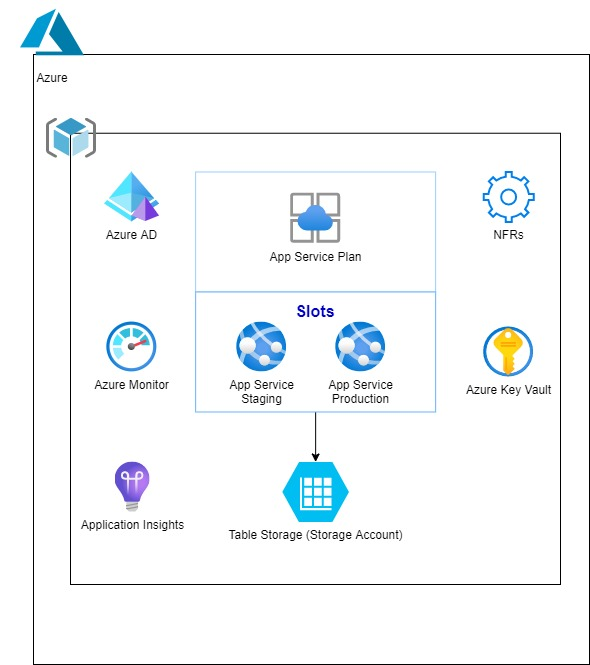

# High Availability

To achieve high availability it is recommended to provision multiple App-Service slots as part of IaC. With current setup, all the environments except DEV has two App-Service slots by default(Staging and Production) as shown below.
For applications requiring high availability for storage, Microsoft recommends using ZRS(Zone-redundant storage) in the primary region and replicating to a secondary region.

