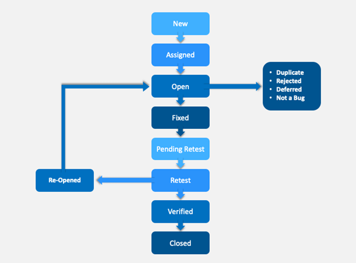

# DAPx Accelerator -  Test Strategy for NILO

## Overview
This Test Strategy document describes the proposed standards for testing processes and activities related to the DAPx accelerator for NILO. Documents such as the Test Plan should draw their contents from these standards. The below is a set of recommendations based on the test framework provided by the DAPx accelerator.

## Recommended Test Types

 

### Functional Testing
**Integration testing**: We recommend Integration testing which is carried out by testers. Testing the interactions between integrated components or systems. Recommend the Selenium C# automation framework provided in our accelerator to achieve Integration testing.

**UI testing**: We recommend UI testing which is carried out by testers. Testing the Graphical user interface. Recommend the Selenium C# automation framework provided in our accelerator to achieve UI testing.

**Regression testing**: We recommend UI testing which is carried out by testers. Identifying the Regression scenarios and adding them as a group. Recommend the Selenium C# automation framework provided in our accelerator to achieve Regression testing.

**End to End testing**: We recommend End to End Testing which is carried out by testers. Identifying the End to End scenarios as the application grows. End to End can be part of regression. Recommend the Selenium C# automation framework provided in our accelerator to achieve End to End Testing testing.

**Acceptance testing**: Our recommendation involves business users who will be using the system to provide the End to End scenario as a base or whatever the business user comes with the scenarios we have to make sure to add that in our End to End test.

### Non Functional Testing

**Unit testing**: We recommend Unit testing which is carried out by the developers. Testing is done on the smallest piece of code that can be logically isolated in a system. Recommend the Selenium XUnit framework provided in our accelerator to achieve Unit testing.

**Accessibility testing**: Our recommendation is for Accessibility testing. Testing is performed to ensure that the application being tested is usable by people with disabilities or disadvantaged groups. Recommend the Google Lighthouse solution as provided in our accelerator to achieve Accessibility testing.

**Security testing**: Our recommendation is to include security-related testing tools, such as Static code analysis, Vulnerabilities testing, and Penetration testing. Recommend White Source Bolt/OWASP DC/DT for vulnerabilities testing, OWASP Zap for penetrating testing, and SonarCloud/SonarQube for static code analysis. These tools have been included in our build-release pipeline.

**Performance testing**: Our recommendation is to include performance testing tools, such as Apache JMeter. Testing is performed to determine the system parameters in terms of responsiveness and stability under various workloads. However, the performance testing tool is not provided in our accelerator.

## Integration of testing frameworks into the CI/CD Process

 

We intend to provide for a continuous testing approach for all our recommendations and the process to get to that state is described below

1. As part of the framework, test source code is stored alongside the application source code in the same repo.

2. On every pull request/repo change, the Build/Release pipeline is triggered.

3. The Build pipeline has stages such as Build, Unit test, Code quality check, and Vulnerabilities testing using OWASP Dependency check (Vulnerability testing, a software testing technique performed to evaluate the quantum of risks involved in the system to reduce the probability of the event.).

4. The Release pipeline has stages such as deployment, End to End test, penetration test, and accessibility test.

5. The pull request is successful only after all the steps in Build/Release pipeline are successfully executed on the System integration test environment which hosts all these releases.

## Supported Browsers
Browsers supported by the provided automation framework are Chrome, Edge, and Firefox primarily because we are targeting Microsoft-based platforms.

## Managing Software Defects

*This is a general flow/annotations. This could change based on the defect management tools used.

### How we capture defects
Defects will be logged in the defect management tool. The tester should speak to the business analyst or Developer before logging a defect. The testers must capture and attach any relevant screenshots or supporting materials to assist in diagnosing the defect, e.g. screenshots error messages, error logs, etc.

A Defect Report should ideally contain the following information. 

1. **Defect ID** – ID Number, Name, Reporter, Submit date. 

2. **Overview** – Summary, URL 

3. **Test Environment** - Platform, Operating System, Browser, etc 

4. **Details** – Steps to reproduce, Expected Result, Actual result, Description. 

5. **Tracking** – Severity, Priority, Assigned to. 

6. **Additional Info** - Screenshots, System Logs, etc. 

Each Defect should be marked with a severity rating, use the below information to help determine the severity of the defect. 

1. **Blocker**: Testing is inhibited or suspended pending correction or identification of a suitable workaround. 

2. **Critical**: The defect affects critical functionality or critical data. It does not have a workaround. 

3. **Major**: The defect affects major functionality or major data. It has a workaround but is not obvious and is difficult.  

4. **Minor**: The defect affects minor functionality or non-critical data. It has an easy workaround. 

5. **Trivial**: The defect does not affect functionality or data. It does not even need a workaround. It does not impact productivity or efficiency. 

Each Defect should be marked with a priority rating, the below information can be used to help determine the priority of the defect. 

1. **Low**: The Defect is an irritant but a repair can be done once the more serious Defect has been fixed

2. **Medium**: During the normal course of the development activities defect should be resolved. It can wait until a new version is created

3. **High**: The defect must be resolved as soon as possible as it affects the system severely and cannot be used until it is fixed

### Verification & Closure
After the development team fixes the defect, the testing team verifies whether the defects are indeed resolved. Once the defect is resolved then the testing team can now mark the defect as closed. 

## Test Data
Defining test data requirements is equally important. Provide clear instructions on how to create test data (either generate data or if using production data, provide a clear process of masking fields for privacy).
Define test data backup and restore strategy. The test environment database may run into problems and this could result in loss of test data. When there is a database backup strategy defined, loss of test data can be avoided.
The backup and restore process should clearly define, who will be responsible for taking backups when to take a backup, what to include in backup when to restore the database, who will restore it, and data masking steps to be followed if the database is restored.
Masked and realistic test data so that we can spot issues around performance, formatting, etc

## Entry and Exit Criteria for all levels in the Software Testing Life Cycle (STLC) 
### Requirement Analysis 
|  |  |
|---|---|---|
| Entry Criteria  | Requirements Document available (both functional and non - functional).Acceptance criteria is defined.Application architectural document is available.|
| Activity  | Analyse business functionality to know the business modules and module-specific functionalities.Identify all transactions in the modules.Identify all the user profiles.Gather user interface/authentication.Identify types of tests to be performed.Gather details about testing priorities and focus.Prepare Requirement Traceability Matrix (RTM).Identify test environment details where testing is supposed to be carried out.Automation feasibility analysis (if required).|
| Exit Criteria  | Signed off RTM (Requirement Traceability Matrix).Test automation feasibility report signed off by the client.|
| Deliverables  | RTM (Requirement Traceability Matrix).Automation feasibility report (if applicable). |

### Test Planning 
|  |  |
|---|---|---|
| Entry Criteria  | Requirements Documents.Requirement Traceability matrix.Test automation feasibility document. |
| Activity  | Analyse various testing approaches.Finalize the best-suited approach.Preparation of test plan document for various types of testing.Test tool selection.Test effort estimation.Resource planning and determining roles and responsibilities. |
| Exit Criteria  | Approved test plan document.Effort estimation document signed off. |
| Deliverables  | Test plan document.Effort estimation document. |

### Test Case Development  
|  |  |
|---|---|---|
| Entry Criteria  | Requirements Documents.RTM and test plan.Automation analysis report. |
| Activity  | Create test cases, test design, automation scripts (where applicable).Review and baseline test cases and scripts.Create test data or arrange for test data. |
| Exit Criteria  | Reviewed and signed test Cases/scripts.Reviewed and signed test data. |
| Deliverables  | Test cases/scripts.Test data. |

### Test Environment Setup
|  |  |
|---|---|---|
| Entry Criteria  | System Design and architecture documents are available.Environment set-up plan is available. |
| Activity  | Understand the required architecture, environment setup.Prepare hardware and software development requirement list.Finalize connectivity and access requirements.Prepare environment setup checklist.Setup test environment and test data.Perform a smoke test on a stable build.Accept/reject the environment depending on the smoke test result. |
| Exit Criteria  | The environment setup is working as per the plan and checklist.Test data setup is complete.The smoke test is successful. |
| Deliverables  | The environment ready with test data set up.Smoke Test Results. |

### Test Execution
|  |  |
|---|---|---|
| Entry Criteria  | Baselined RTM, Test Plan, Test case/scripts are available.The test environment is ready.Test data set up is done.Unit test report for the build to be tested is available. |
| Activity  | Execute and log defects for failed cases.Update test plans/test cases, if necessary.Map defects to test cases in RTM.Retest the defect fixes.Regression Testing of application (Preferably through automation).Track the defects to closure. |
| Exit Criteria  | All tests planned are executed.Defects logged and tracked to closure. |
| Deliverables  | Completed RTM with execution status.Test cases updated with results.Defect reports. |

### Test Cycle Closure
|  |  |
|---|---|---|
| Entry Criteria  | Testing has been completed.Test results are available.Defect logs are available. |
| Activity  | Evaluate cycle completion criteria based on - Time, Test Coverage, Software Quality, Critical Business Objectives.Prepare test metrics based on the above parameters.Document the learning out of the project.Prepare Test closure report.Qualitative and quantitative reporting of quality of the work product to the customer.Test result analysis to find out the defect distribution by type and severity. |
| Exit Criteria  | Test Closure report signed off by the client. |
| Deliverables  | Test Closure report.Test metrics. |

## QA Sign-off
The main aim of a QA is to make sure that the software meets the customer’s needs. The formal way of declaring this process is to Sign Off. The QA can acknowledge that they have reviewed and tested the application and now the application is ready to release.

### Criteria for QA Sign Off
QA can do Sign off after meeting the exit criteria. In exit criteria, the QA checks the following things 

1. All the necessary test plans should Run. 

2. The software should meet Customer needs. 

3. There should be no High/Immediate/Urgent issues present in the Software. 

4. All the priority tasks should get done. 

5. All the priority test cases should Run and should pass the execution. 

6. The level of Requirement coverage should meet. 

7. The development activities should not go beyond the cost of the project. 

8. The development activities should not cross the deadline. 

Sign-off can be done nowadays by way of a project tracking tool, e.g., Jira, Azure Boards, etc. A sign-off template can be added. All the necessary fields can be added to the template, e.g., required sign-offs required steps to be completed for a sign-off, whether the targets are achieved, etc. This can be attached to the release document.

## Known Defects
At the end of the project cycle, there can be outstanding defects that have not been resolved, these should be reported to the stakeholders so as to decide what actions should be taken, i.e., the decision as to whether to proceed ahead with these defects listed as “Known Defects” with a plan in place to address them in next phase or resolve them immediately. This can be attached to the release document.

## Tools to be used   
| SL No | Type of testing | Tool|
|---|---|---|
| 1  | Unit testing. | XUnit |
| 2  | Functional/Integration/E2E  testing. | C# Selenium, Recommended BDD using Spec Flow |
| 3  | Defect Tracking. | Jira/Azure Devops |
| 4  | Agile and Scrum. | Jira |
| 5  | Static code analysis. | Sonar cloud |
| 6  | Vulnerability testing. | OWASP DC |
| 7  | Penetration testing tool. | OWASP ZAP |
| 8  | Accessibility testing. | Lighthouse |
| 9  | Testcase development. | Zephyr |
| 10  | Performance testing. | Apache JMeter |
