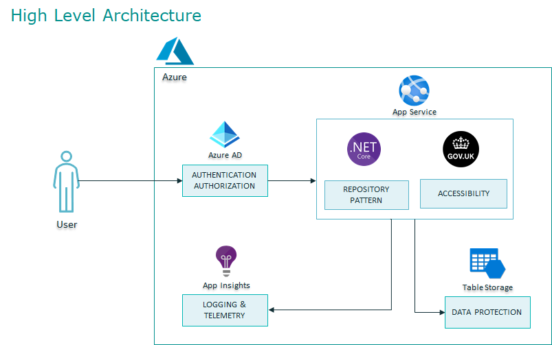

# DAPx Accelerator: Bespoke Application Development using Azure & .NET MVC

[![GDS](https://img.shields.io/badge/UK%20Gov-GDS-black?style=plastic&logo=data:image/png;base64,iVBORw0KGgoAAAANSUhEUgAAACAAAAAgCAMAAABEpIrGAAACqVBMVEUAAAAAAAAAAAACAgIBAQEBAQIAAAEAAAABAQEJCQoICAgjIyQ2Njc3NzcdHR4KCgtnZ2j%2F%2F%2F9KSksODg8cHB329vbb29sNDQ4VFRYAAAECAgMLCwwGBgcSEhO7u7yxsbHu7u7e3t61tbW2trcBAQIKCgw5OTlsbG0pKSoFBQYEBAXo6On4%2BPn39%2FfW1tY4ODhtbW4tLS4HBwgkJCXr6%2BvV1dUYGBkzMzQZGRqQkJBUVFXi4uLQ0NFmZmYPDxA0NDUMDAzo6Ojb29wICAkHBwlcXF0%2BPj%2Fv7%2B7Pz8%2F8%2FPyoqKk1NTb7%2B%2Fy%2Bvr%2F7%2B%2FsbGxxLS0tOTlCNjY1VVVZ6envAwMBWVldDQ0Tw8PCMjI13d3ceHh91dXa8vLxfX19ubm9xcXLBwcF3d3gWFhfs7OyCgoIFBQXY2NnExMSdnZ2kpKWioqOenp4xMTPCwsIfHyAMDA3f39%2FGxscDAwMiIiMDAwTFxcW3t7dhYWJRUVLKyspGRkcEBAZfX2BdXV2YmJhOTk8gICFCQkNaWluwsLFra2vNzc5KSko%2FP0AHBwdEREWSkpKmpqdBQUKzs7MhISNycnPv7%2B%2FExMVXV1guLi%2Brq6u0tLRERESnp6cnJyjn5%2BdFRUY0NDTj4%2BP5%2Bfnd3d4vLzB5eXqmpqYxMTKsrK1OTk7Z2dnp6elzc3O%2Fv7%2Fy8vPGxsaWlpf6%2Bvo8PDyzs7RAQEGsrKz9%2Ff2NjY46OjqhoaHAwMG3t7iZmZnFxcbU1NVlZWaSkpM8PD1oaGhPT1Dx8fFmZmfNzc0mJidjY2Slpabw8PHLy8yysrKKiotgYGHy8vJFRUWioqJpaWpycnLT09PHx8f%2B%2Fv74%2BPi7u7tISEn09PTk5OQUFBXIyMjm5ubLy8u9vb2qqqra2tuurq8GBgYRERJMTExnzMt3AAAAB3RSTlPc7fPt7e3tLA1oygAAAo5JREFUeNp8yoMRwEAABMCLbdv9l5jkh%2B8dHgBDCzA9LROGTyMdUxiwAkoYxUka0o0FK6N4eVGUHt0wh6Cq6qbtetlh8MYpm5d124%2FzGgNS3A91%2BAonp8bI0iiKVkUnTva4MOa98Y2NQmzbtm3btjmeydhI2rb7l3T80lrPHw7WFn7y6WcMSyI96BvAkIhhjYxNmKMDIo7I1AzmOhaWVtY2tnb21g6OThbOcHmbSLJ%2FQPqqTK4JuJq4uXuQJ7w0WG%2Bfdy0BL18%2FfzWJIk9JNQAIDAoOCQXCuHAgIhLAZ1HRMbFAHCnz%2BMJ4IIEYSoxOSk5JBdK49Pcy1EhImUAWKfEUKTvng9wUjmPycgU6%2BUBBIVskEXOSYs%2BS0qKP9r5ILCsXFIs4iZArlhTaVJRUFnLFHCuRiARV1TV5Sjx%2BLVCnytZHN6jqiDjaQyL6mBqb3hRTMxDE5%2FHjgViiarSIOLF2q7zNz6qdtbBFB1En0LV3oLsnvZeoD%2F25AuFbbwADagx5AoNEQ8Mjnio8JRod%2B3RcVaN%2FYpwm26YMpl%2BzcSSjmdm3JXPzC4u0NyiSIWNJurxisLpWifWN6U1Ybq1%2BnvNF4pcL%2BEp174CEvv5mZvA9oODb7%2FD95vYPBkM%2F%2FgT8%2FAvcf6UDH%2Bg3g63f%2F6j705cs%2F6K%2FPWj%2BHxpybhj897%2F%2FTT862CbH7uxKSMPnFEt02v3MWSKHcxNvksXOGB2tm85j%2B8ImcPHdS5eBK9G7%2BcDVCENcOz4gHL%2BOZ3DjJnN0QMLewsxt8zvrd%2B8tdHUt3Lsb73b%2F9gwekNqxUQ89J4fqH0noGEFeYv3QY0%2F2RDnRRyQoZji1E8Rs8YGlRwdewIGTL2TPB%2FaFKL00vC%2BN%2FxM%2F7L0xXBEfOAAAAABJRU5ErkJggg%3D%3D)](https://www.gov.uk/government/organisations/government-digital-service)

## Overview
This is a foundational accelerator that focuses on providing many of the Non Functional Requirements most projects typically require. This particular accelerator caters for a technology stack involving .NET MVC, Azure & Azure DevOps

This accelerator implements the following Architectural Blueprint: 

## Repositories
This accelerator is composed of a number of code repositories, each dealing with different aspects of the accelerator. 

| Name| Repository | Description |
| ---------- | ---------- | ----------- |
| **Documentation** | [**dapx-accelerator-az-mvc-docs-poc-he-nilo**](https://git.version1.com/projects/VDAPX/repos/dapx-accelerator-az-mvc-docs-poc-he-nilo) | **Documentation (This Repo)** |
| IaC | [dapx-accelerator-az-mvc-iac-poc-he-nilo](https://git.version1.com/projects/VDAPX/repos/dapx-accelerator-az-mvc-iac-poc-he-nilo) | Terraform code to create infrastructure |
| App | [dapx-accelerator-az-mvc-app-poc-he-nilo](https://git.version1.com/projects/VDAPX/repos/dapx-accelerator-az-mvc-app-poc-he-nilo) | .NET Core MVC application |

## What’s Included?

1. Terraform based **Infrastructure as Code** library with Azure DevOps pipelines to create 4 environments (Resource Groups on Azure) - DEV, SIT, UAT & PRD
2. **Azure DevOps configuration** including Environment pipelines, CI/CD pipelines, DevSecOps, Code Quality Analysis, Branching Policies, Extensions etc.
3. **Starter for ten codebase** which provides a .NET MVC application with a sample HTML interface aligned to UK GDS design standards and with best practices baked into the code such as logging, error handling etc.
4. **Detailed documentation** including installation guides, extensibility guides, architectural docs
5. **DevSecOps** configuration including Static Code Analysis, dependency scanning
6. **Test Automation Suite** including Unit Tests, End-2-End Tests, Accessibility Tests and Penetration Tests
7. **Non Functional Requirements** including High Availability, Backups, Monitoring & Alerting, Policies as Code, Security & Data Encryption, Accessibility (WCAG 2.1 AA), Usability etc.

For more specifics on what is included, please visit the [What's Included page](whats-included.md) or inspect the code.

## Getting Started

1. [Learn more](architecture/readme.md) about the architecture and design.
2. [Install](installing.md) the accelerator
3. [Extend and modify](how-tos/readme.md) the accelerator for your project's needs

## Roadmap

View our [roadmap](roadmap.md).

## Changelog

View our [changelog](changelog.md).

## Contributing

We strongly encourage contribution from the wider organization and have defined a process to facilitate this. Please see our [How to Contribute](https://version1.sharepoint.com/sites/dapx/SitePages/Contribute-to-DAPx.aspx) guide.
